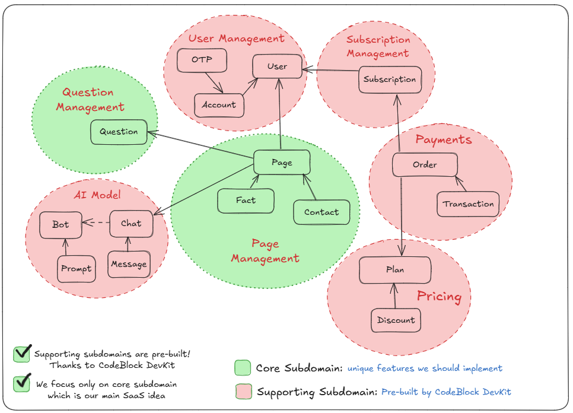

# Hey It's Me! 🎯

Create your personal fact page with AI and share it on social media. Build deeper connections by sharing authentic stories, achievements, failures, and secrets that help others discover the real you.

**Live Demo:** [hey-it-is.me](https://hey-it-is.me/)

## 🚀 What is Hey It's Me?

Hey It's Me! is an AI-powered personal page builder that transforms simple conversations into stunning visual facts about yourself. Unlike traditional bio pages, we help you share intimate stories, achievements, failures, and secrets that create authentic relationships based on genuine understanding.

### ✨ Key Features

- **AI-Powered Fact Generation**: Chat with our AI that asks questions and generates interesting facts about you
- **Professional AI Images**: Our AI generates beautiful images for each fact based on your photo and the fact content
- **Personalized URLs**: Create unique links like `hey-it-is.me/yourname`
- **Social Media Integration**: Perfect for Instagram, X (Twitter), TikTok, and other platforms
- **Analytics & Insights**: Track who's interested in your story
- **Multiple Plans**: From Essential (20 facts) to Premium (100 facts) with unlimited contacts

## 🎯 Why Create Your Fact Page?

### Build Deeper Connections
Share intimate facts and stories that create authentic relationships based on genuine understanding.

### Share Without Judgment
Express your failures, achievements, and secrets without fear of judgment. Create a safe space to be authentically yourself.

### Find Your Perfect Match
Help others discover shared interests, values, and personality traits. Your page becomes a magnet for like-minded people.

### Boost Your Online Presence
Get discovered by search engines and AI models. Track analytics to see who's interested in your story.

## 🏗️ Built With CodeBlock DevKit

This project is built using the [CodeBlock DevKit SaaS Template](https://github.com/CodeBlock-Dev/CodeBlock.DevKit.SaaS.Template) and serves as both:

1. **A Complete Open-Source Example** - Perfect for CodeBlock DevKit users to learn from
2. **A Real Production SaaS** - A live application generating revenue

### Follow the Journey

Join us on [X (Twitter)](https://twitter.com/hamed_shirbandi) to follow the development journey and see how we're building and growing this SaaS application.

### Why This SaaS Idea?

- **Validated Concept**: Similar to Linktree but with AI-powered personal storytelling
- **Clear Value Proposition**: Help people share authentic stories and build deeper connections
- **Scalable Business Model**: Subscription-based with room for premium features
- **AI Integration**: Leverages modern AI for content and image generation
- **Social Media Ready**: Perfect for the current social media landscape

## 🏛️ Domain Model

**Built with ❤️ using [CodeBlock DevKit](https://codeblock.dev)**
